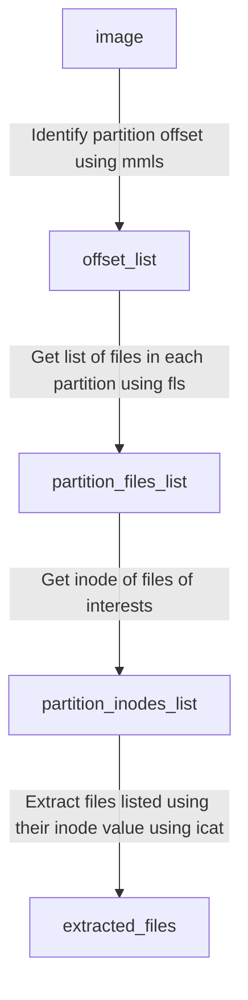

# Notes on WSL, SIFT-CLI, and EZTools

- Install Ubuntu WSL from microsoft store. ``sitslade:3nc0dL...``

- Install SIFT-CLI in Ubuntu using **mode=server**

  ```
  curl -Lo /usr/local/bin/sift https://github.com/sans-dfir/sift-cli/releases/download/v1.11.0/sift-cli-linux
  chmod +x /usr/local/bin/sift
  ```

  ```
  sift install --mode=server
  ```

- Install required libs on ubuntu

  ```
  pip install uvicorn
  ```

- Run main.py server on ubuntu

  ```
  cd /mnt/c/Users/16sic/Desktop/custodio(for demo, path will change)
  uvicorn main:app --reload
  ```

- Run postman and send request to API ```/ingest-image```

# Reference

- [CLI tool to manage a SIFT Install](https://github.com/teamdfir/sift-cli)
- [The lightning-fast ASGI server.](https://github.com/encode/uvicorn)

