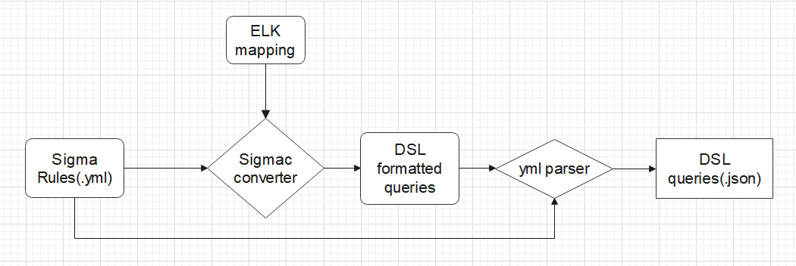

# Playbook

The current playbook module runs independently for demo purpose, to be integrated once confirmed in consensus. 

## Installation

### Requirements

- [Local Elastic folder](https://www.elastic.co/downloads/elasticsearch)
- [Python ES Client Library](https://elasticsearch-py.readthedocs.io/en/v7.12.1/)
- [Sigma Rule converter python library](https://pypi.org/project/sigmatools/)
- [Existing Sigma Rules](https://github.com/SigmaHQ/sigma/tree/master/rules)
- [Sigma Converter Config](https://github.com/SigmaHQ/sigma/tree/master/tools/config)

### Installation

1. Download ES Zip file, extract and run elasticsearch-7.12.1\bin\elasticsearch.bat to run server
2. Download Sigma rule config name 'helk.yml' and place it in main folder
3. Open 'helk.yml' and comment out everything under '*fieldmappings*'
4. Download Sigma rules and place in main folder
5. To test a sample, open CMD in main folder and run command ```sigmac -t 'es-dsl' -c .\helk.yml .rules\[pick your rules in yml]```
6. The CMD will output a ES related search, save it or copy it
7. Create a query script using Python ES client library and run script on a preprocessed eventlogs
8. To run on all rules, Run rules2jsonfile.py script to aggregate all rules into {id, description, query} list

### Limitation

- Need to change key names for ES queries. Eg. event_id to EventID.
- Query errors unidentified

## Demo Prerequisite

These are steps done to create the scripts

- Downloaded ElasticSearch
- Downloaded Sigma "windows" rules
- Downloaded Sigma config "helk.yml" for conversion
- Created a script to manually iterate through the windows rules folder to find all yml, gather all ttp id and queries associated to create a list of queries in JSON file
- Created a main.py script to call ES client, create index and upload preprocessed json log. Followed by loading the query and running a search

### To run the demo

1. Download Elasticsearch folder from the link above, extract and add the folder to "SLADE-KGA\CIE_server\playbook\", rename it to tools_elasticsearch
2. Run "SLADE-KGA\CIE_server\playbook\tools_elasticsearch\bin\elasticsearch.bat" to start the server
3. finally, run main.py to run a demo search on data in the data folder

## Process Flow



