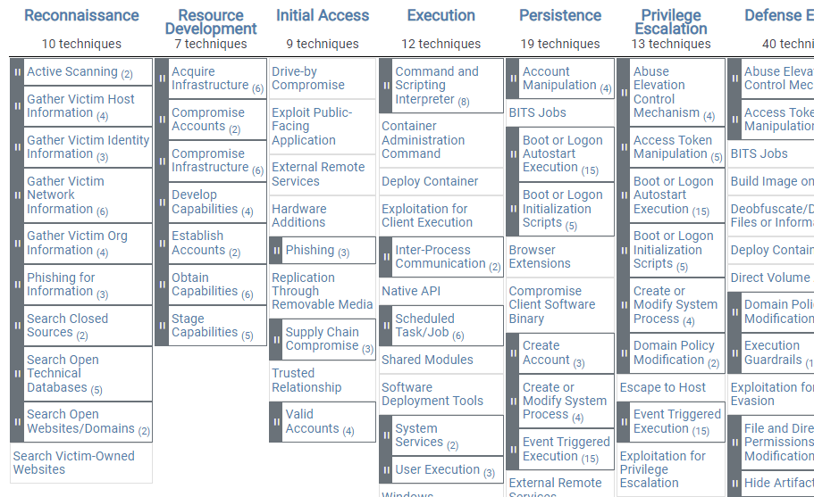
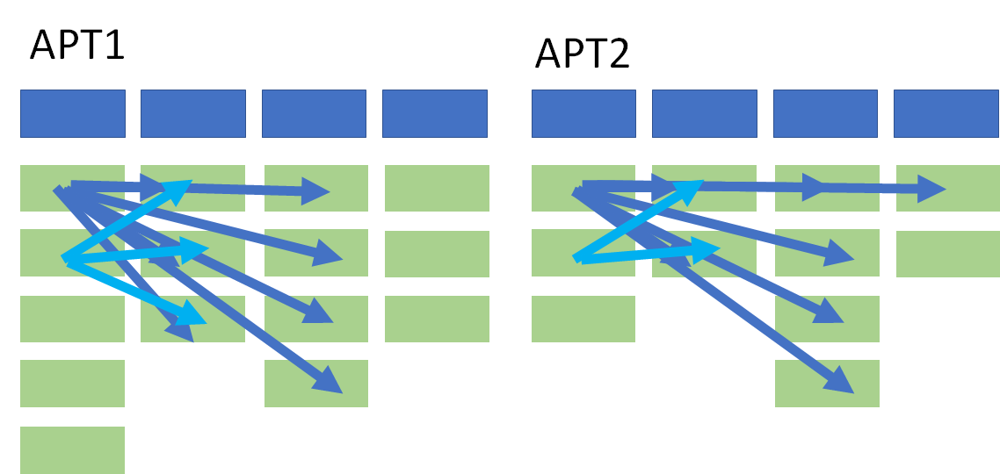
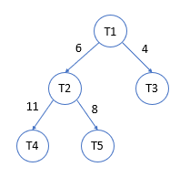
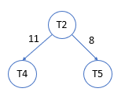
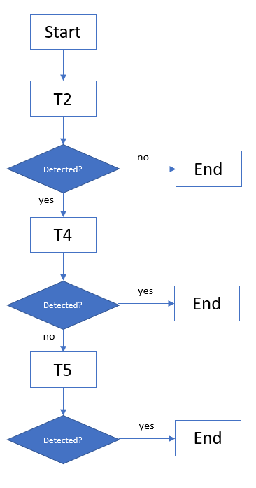
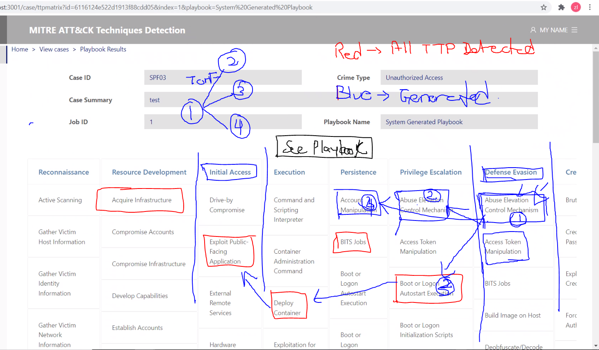

# Overview

To generate a workflow for playbook scripts using graph and DFS by referencing APT dataset. 

# Generator Algorithm

1. Firstly, since the proposed approach are tested on Windows platform, we filtered the MITRE ATTACK list to only contains Windows based TTPs. (**May have to filter to only cater to TTP ids set by Custodio**)

2. Following the the MITRE ATTACK table(figure 1), we create a list of APT Matrix that consists of permutated values of every columns(as shown in figure 2) to calculate how many time the TTP pairs are called together. For example, APT1 = {(T1,T2), (T2,T3), (T2,T4)}, APT2 = {(T1,T2), (T2,T4), (T5,T6)}. Column wise permutation are used in order of the sequence of the MITRE ATTACK framework attack sequence.

   1. 

   2. 

3. The pairs of TTPs are then aggregated by the number of times the same pairs appear together to form a weightage table(figure 3) for the pairs in order to create a weighted graph.

   1. | source | target | weight |
      | ------ | ------ | ------ |
      | T1     | T2     | 6      |
      | T1     | T3     | 4      |
      | T2     | T4     | 11     |
      | T2     | T5     | 8      |

      Figure 3: An pairwise table with weights

4. Once the weighted graph is generated(Figure 4), a Depth First Search Algorithm is used to generate a subgraph based on highest weight path for every edges connected to the TTP id. The generated DFS path will then be converted to a flow chart in the front end for sequential TTP detection(figure 6)

   1. Figure 4

      

   2. Figure 5

   3. Figure 6

## Low Level algorithm for weighted depth first search

```
graph = {(A,B,4), (A,C,6), (B,C,2)}
rootnode = A
visted = []
result = []
1. if node not in visited
	1a. detect ttp
		1a.1 if detect ttp, add to result
    1b. add node to visited
    1c. get weight of all neighbours of node
    1d. get the next max weighted node
    1e. repeat (1) using the next max weighted node
2. else end

```

# User Guide v1

1. Store and preprocess Disk Image
2. Extract and store EVTX logs
3. In the Playbook page, user picks a TTP id from drop down list ["Credential Access", "Exfiltration"] based on the crime type they want to generate the TTP from. Eg. Exfiltration["Automatic Exfiltration(T1020)", "Data Transfer Limit(T1030)", "Exfiltration over Alternative(T1048)"...]
4. User selects "Automatic Exfiltration(T1020)"
5. Using the algorithm above(**Generator Algorithm**), a flow chart will be generated for the "Automatic Exfiltration(T1020)" and its associated TTPs
6. User is then presented with the flowchart
7. User can choose to edit or run the playbook flowchart
8. After running, in the background the playbook will search the generated flowchart sequentially
9. Once the playbook has completed its detection search, it will display a collated result of the TTP id found in the system

# User Guide v2

```
Based on discussion by Prof Peter during wednesday's meeting on 11.24.2021
```

1. Store and preprocess Disk Image
2. Extract and store EVTX logs
3. Run a default playbook that detects all TTPs found in the logs
4. Display the detected TTPs into a MITRE Attack table with detected TTP highlighted in orange
5. In the table, the TTPs for Credential Access and Exfiltration will be clickable since we are dealing with Unauthorized Access and Data Theft
6. User can then pick one of the TTPs
7. Then, user will be prompted the group of TTPs that is associated with the TTP that he clicked on
8. Once the user confirms, he will be directed to the playbook generator page
9. Using the algorithm above(**Generator Algorithm**), a flowchart will be generated and presented
10. User can choose to edit or run the playbook flowchart
11. After running, in the background the playbook will search the generated flowchart sequentially
12. Once the playbook has completed its detection search, it will display a collated result of the TTP id found in the system.



# Reference

- [Finding Related ATT&CK Techniques](https://medium.com/mitre-attack/finding-related-att-ck-techniques-f1a4e8dfe2b6)
- [MITRE MATRIX](https://mitre-attack.github.io/attack-navigator//#layerURL=https%3A%2F%2Fattack.mitre.org%2Fgroups%2FG0018%2FG0018-enterprise-layer.json)


Created by Isfaque.